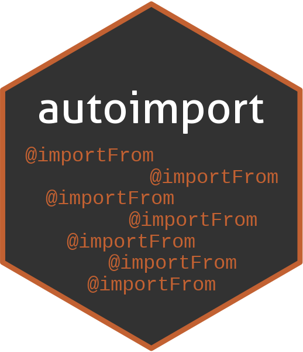

# autoimport <a href='https://DanChaltiel.github.io/autoimport/'></a>

<!-- badges: start -->

[](http://www.gnu.org/licenses/gpl-3.0.html) 
[](https://lifecycle.r-lib.org/articles/stages.html#stable) 
[](https://CRAN.R-project.org/package=autoimport) 
[](https://github.com/DanChaltiel/autoimport)
[](https://github.com/DanChaltiel/autoimport/actions/workflows/R-CMD-check.yaml)

<!-- badges: end -->

`autoimport` is a package designed to easily add `@importFrom` roxygen tags to all your functions.


## Concept

When importing functions into a package, the [R Packages (2e)](https://r-pkgs.org/dependencies-in-practice.html#in-code-below-r) guidelines recommend using `@importFrom`, either above each function or in a dedicated section of the package-level documentation.

But let's be honest for a second, this is one of the most tedious tasks ever, isn't it?
And we are devs, we love automating things, don't we?

Meet `autoimport`!
It parses your code, detects all imported functions, and adds the appropriate `@importFrom` tags in the right place. Just like that!


## Installation

Install either from the stable version from CRAN or the dev version from GitHub:

``` r
# Install from CRAN
pak::pak("autoimport")
# Install from Github
pak::pak("DanChaltiel/autoimport")
```


## Getting started

Just run the function, it's showtime!

``` r
devtools::load_all(".")
autoimport::autoimport() #location="function" by default
#autoimport::autoimport(location="package")
```

The first run might take some time, but a cache system is implemented so that next runs are faster.

Afterward, you can see the diff and accept the changes using the shiny widget:

``` r
autoimport::import_review()
```

However, a picture is worth a thousand words:


As you could probably tell, the shiny widget is ~~stolen from~~ inspired by `testthat::snapshot_review()`. Many thanks for them for this gem!

## Important notes

-   `autoimport` will guess the potential source of your functions based on (1) the packages currently loaded in your environment (e.g. via `library()`), and (2) the packages listed as dependencies in DESCRIPTION.

-   `load_all(".")` is required for autoimport to have access to the package's private functions, for example so that `dplyr::filter()` cannot mask `yourpackage:::filter()`.

-   Some package guesses are bound to be wrong, in which case you should use `usethis::use_import_from()`. See "Limitations" below for more details.


## Limitations

Autoimport is based on `utils::getSrcref()` and share the same limits. Therefore, some function syntaxes are not recognized and `autoimport` will try to remove their `@importFrom` from individual functions:

-   Operators (`@importFrom dplyr %>%`, `@importFrom rlang :=`, ...)
-   Functions called by name (e.g. `sapply(x, my_fun))`
-   Functions used inside strings (e.g. `glue("my_fun={my_fun(x)}")`)

To keep them imported, you should either use a prefix (`pkg::my_fun`) or import them in your package-level documentation, as this file is ignored by default (due to `ignore_package=TRUE`).

For that, `usethis::use_import_from()` and `usethis::use_pipe()` are your friends!

## Cache system

As running `autoimport()` on a large package can take some time, a cache system is implemented, by default in file `inst/autoimport_cache.rds`.

Any function not modified since last run should be taken from the cache, resulting on a much faster run.

In some seldom cases, this can cause issues with modifications in DESCRIPTION or IMPORTLIST not being taken into account. Run `clean_cache()` to remove this file, or use `use_cache="write"`.


## Algorithm

When trying to figure out which package to import a function from, `autoimport()` follows this algorithm:

-   If the function is prefixed with the package, ignore
-   Else, if the function is already mentioned in NAMESPACE, use the package
-   Else, if the function is exported by only one package, use this package
-   Else, ask the user from which package to import the function
-   Else, warn that the function was not found

Note that this algorithm is still a bit experimental and that I could only test it on my few own packages. Any feedback is more than welcome!


## Style

As I couldn't find any standardized guideline about the right order of `roxygen2` tags (#30), `autoimport` puts them:

-   in place of the first `@importFrom` tag if there is one
-   just before the function call otherwise

